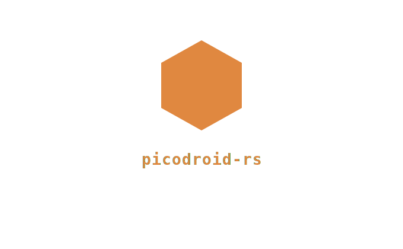

<p align="center">
  
</p>

# Picodroid

A stripped-down, FreeRTOS-based version of Android for the Raspberry Pi Pico.

Apps are written in Java, compiled to bytecode, and interpreted by a lightweight JVM built in Rust — running directly on bare-metal embedded hardware.

## What is Picodroid?

| Layer | Technology |
|-------|-----------|
| Hardware | Raspberry Pi Pico (RP2040, dual Cortex-M0+ @ 125 MHz) or Pico 2 (RP2350, dual Cortex-M33 @ 150 MHz) |
| RTOS | FreeRTOS SMP — both cores active (via [freertos-rust](https://github.com/shivrajora/FreeRTOS-rust)) |
| Runtime | Custom JVM interpreter in Rust (`jvm/` library crate) |
| Java API | Android-compatible (`picodroid.util.Log`, etc.) |
| Logging | [defmt](https://defmt.ferrous-systems.com/) over RTT |

### Execution flow

```
FreeRTOS SMP scheduler (both cores)
  ├── "pdb" task  (priority 2, core 1)  ← listens on UART1 for pdb install
  └── "jvm" task  (priority 1, core 0)
       └── JVM interpreter (jvm/ crate)
            └── Java bytecode (.papk — baked into Flash or hot-swapped via pdb)
                 ├── native dispatch → GPIO / UART / I2C / SPI / Log
                 └── Thread.start() → "jvm-t" child tasks (core 0, self-delete on exit)
```

Apps can be hot-swapped at runtime via `pdb install` without reflashing the firmware.

## Hardware

- Raspberry Pi Pico (RP2040) or Raspberry Pi Pico 2 (RP2350)
- An SWD debug probe: [Raspberry Pi Debug Probe](https://www.raspberrypi.com/products/debug-probe/), Picoprobe, J-Link, or any CMSIS-DAP adapter

## Quick Start

```bash
git clone --recurse-submodules https://github.com/shivrajora/picodroid-rs
cd picodroid-rs
./scripts/build.sh --app helloworld
./scripts/flash.sh --app helloworld
```

After flashing, push a new app over UART without reflashing:

```bash
cargo run -p pdb -- -s /dev/cu.usbmodem102 install build/apks/blinky.papk
```

See [docs/getting-started.md](docs/getting-started.md) for prerequisites, chip selection, app selection, and UF2 flashing.

## Documentation

- [Getting Started](docs/getting-started.md) — prerequisites, build, flash, chip/app selection, and hot-swap with pdb
- [Examples](docs/examples.md) — all included example apps
- [Writing Apps](docs/writing-apps.md) — how to create a new Java app, supported language features, and porting to a new platform
- [Java API](docs/java-api.md) — `picodroid.*` system API reference
- [Debugging](docs/debugging.md) — RTT logging and GDB

## Project Structure

```
picodroid-rs/
├── jvm/                # JVM interpreter — reusable library crate (pico-jvm)
│   └── src/            # no_std + alloc only; no hardware dependencies
│
├── sdk/                # Android-compatible Java API stubs (picodroid.*)
│
├── examples/           # Example apps, each with Java sources and a PicodroidManifest.xml
│
├── src/
│   ├── app.rs          # JVM bootstrap (run_jvm, shared heap, class loader)
│   ├── pdb/            # Picodroid Debug Bridge — UART listener + hot-swap logic
│   ├── port/           # pico-sdk shims (direct register access; no pico-sdk dependency)
│   └── system/         # Native implementations of Java API methods
│
├── tools/
│   ├── papk-pack/      # Host tool: packages compiled .class files into a .papk file
│   ├── papk-info/      # Host tool: inspect .papk file contents (manifest, classes, sizes)
│   └── pdb/            # Host tool: push .papk to a running device over UART
│
├── vendor/             # Downloaded tooling (google-java-format JAR; gitignored)
│
├── memory.x            # RP2040 linker memory layout
├── memory_rp2350.x     # RP2350 linker memory layout
├── third_party/        # Git submodules (FreeRTOS-Kernel)
└── build.rs            # Compiles FreeRTOS C, embeds pre-built .papk into firmware Flash
```

## Attribution

Project scaffolding based on [rp2040-project-template](https://github.com/rp-rs/rp2040-project-template).

## License

Apache-2.0
