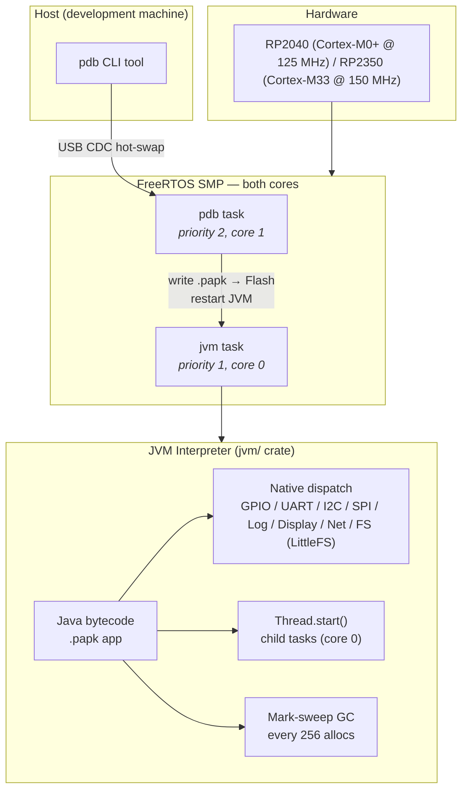

<p align="center">
  
</p>

<p align="center">

[](https://github.com/shivrajora/picodroid-rs/actions/workflows/ci_checks.yml)


</p>

# Picodroid

A stripped-down, FreeRTOS-based version of Android for the Raspberry Pi Pico.

Apps are written in Java, compiled to bytecode, and interpreted by a lightweight JVM built in Rust — running directly on bare-metal embedded hardware.

## What is Picodroid?

| Layer | Technology |
|-------|-----------|
| Hardware | Raspberry Pi Pico (RP2040, dual Cortex-M0+ @ 125 MHz) or Pico 2 (RP2350, dual Cortex-M33 @ 150 MHz) |
| RTOS | FreeRTOS SMP — both cores active (via [freertos-rust](https://github.com/shivrajora/FreeRTOS-rust)) |
| Runtime | Custom JVM interpreter in Rust (`jvm/` library crate) |
| Java API | Android-compatible: `picodroid.util.Log`, `picodroid.widget.*` (LVGL-backed UI), `picodroid.io` (LittleFS files), `picodroid.content.Preferences`, `picodroid.net` (TCP/UDP over WiFi on Pico 2 W), `picodroid.concurrent.Thread`, etc. |
| Logging | [defmt](https://defmt.ferrous-systems.com/) over RTT |

### Architecture



Apps can be hot-swapped at runtime via `pdb install` without reflashing the firmware.

## Hardware

- Raspberry Pi Pico (RP2040) or Raspberry Pi Pico 2 (RP2350)
- An SWD debug probe: [Raspberry Pi Debug Probe](https://www.raspberrypi.com/products/debug-probe/), Picoprobe, J-Link, or any CMSIS-DAP adapter

## Quick Start

```bash
git clone --recurse-submodules https://github.com/shivrajora/picodroid-rs
cd picodroid-rs
./scripts/build.sh --app helloworld
./scripts/flash.sh --app helloworld
```

After flashing, push a new app over USB CDC without reflashing:

```bash
cargo run -p pdb -- -s /dev/cu.usbmodem102 install build/apks/blinky.papk
```

Check device health (heap, tasks, CPU usage) at any time:

```bash
cargo run -p pdb -- -s /dev/cu.usbmodem102 sysmon
```

Display apps (e.g. `displaydemo`) open a graphical window with mouse-as-touch input when run in the simulator.

See [docs/getting-started.md](docs/getting-started.md) for prerequisites, chip selection, app selection, and UF2 flashing.

## Documentation

Start at [docs/README.md](docs/README.md) for the full index. Highlights:

- [Getting Started](docs/getting-started.md) — prerequisites, build, flash, board/app selection, simulator, hot-swap
- [Writing Apps](docs/writing-apps.md) — create a new Java app + supported language features
- [Java API](docs/java-api.md) — split by area: [core](docs/api/core.md), [system](docs/api/system.md), [peripherals](docs/api/peripherals.md), [storage](docs/api/storage.md), [networking](docs/api/networking.md), [UI](docs/api/ui.md)
- [Class-name Shrinker](docs/shrinker.md) — opt-in (`--shrink`) release-tied, append-only shrink maps applied to framework `.class` files and PAPK cross-references
- [Contributing](CONTRIBUTING.md) — how to contribute, run tests, and add new features

## Project Structure

```
picodroid-rs/
├── jvm/                # JVM interpreter — reusable library crate (pico-jvm)
│   └── src/            # no_std + alloc only; no hardware dependencies
│
├── sdk/                # Android-compatible Java API stubs (picodroid.*)
│   ├── java/           # Framework Java sources (compiled into firmware Flash)
│   ├── keep.toml       # Class-name shrinker keep list
│   └── shrink-maps/    # Immutable per-release shrink maps (v<semver>.toml)
│
├── examples/           # Example apps, each with Java sources and a PicodroidManifest.xml
│
├── src/
│   ├── app.rs          # JVM bootstrap (run_jvm, shared heap, class loader)
│   ├── lifecycle.rs    # Application/Activity lifecycle management
│   ├── lvgl_ffi.rs     # FFI bindings to the LVGL graphics library
│   ├── drivers/        # Display and touch hardware drivers (ST7789, XPT2046)
│   ├── boards/         # Board-specific pin and peripheral configurations
│   ├── hal/            # Hardware Abstraction Layer (rp/ for Pico, sim/ for host simulator)
│   │   └── rp/port/    # pico-sdk C shims (headers + FreeRTOS interop shims)
│   ├── packagemanager/ # Flash storage and PAPK install logic
│   ├── pdb/            # Picodroid Debug Bridge — UART listener + hot-swap logic
│   └── system/         # Native implementations of Java API methods
│
├── tools/
│   ├── papk-pack/      # Host tool: packages compiled .class files into a .papk file
│   ├── papk-info/      # Host tool: inspect .papk file contents (manifest, classes, sizes)
│   ├── class-shrink/   # Host tool: release-tied class-name shrinker (see docs/shrinker.md)
│   └── pdb/            # Host tool: push apps and monitor device health over USB CDC
│
├── scripts/            # Build, flash, sim, pdb, test, and pre-commit scripts
│
├── vendor/             # Downloaded tooling and libraries (google-java-format JAR, LVGL; gitignored)
│
├── memory.x            # RP2040 linker memory layout
├── memory_rp2350.x     # RP2350 linker memory layout
├── third_party/        # Git submodules (FreeRTOS-Kernel)
└── build.rs            # Compiles FreeRTOS C, embeds pre-built .papk into firmware Flash
```

## Attribution

Project scaffolding based on [rp2040-project-template](https://github.com/rp-rs/rp2040-project-template).

## License

Apache-2.0
