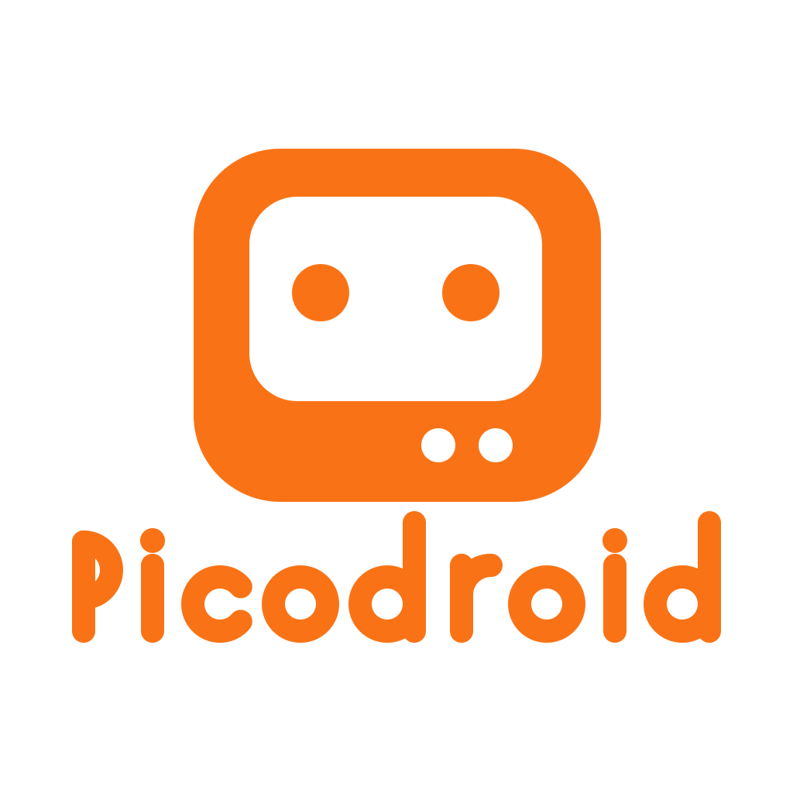
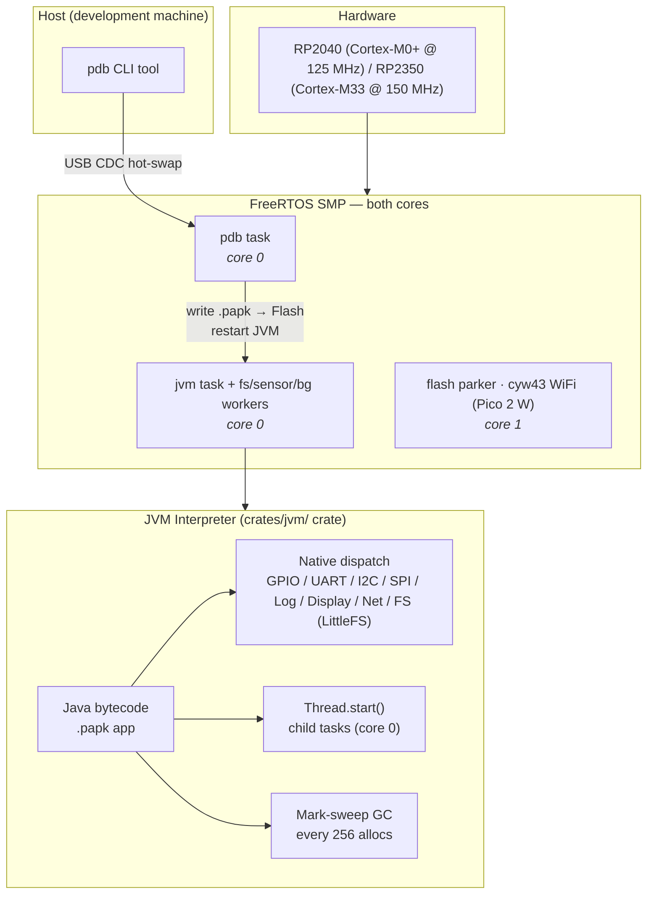

<p align="center">
  
</p>

<p align="center">
  <a href="https://github.com/shivrajora/picodroid-rs/actions/workflows/ci_checks.yml"></a>
  
  
</p>

<p align="center">
  <a href="https://shivrajora.github.io/picodroid-rs/"><b>Documentation</b></a>
</p>

# Picodroid

A stripped-down, FreeRTOS-based version of Android for the Raspberry Pi Pico.

Apps are written in Java, compiled to bytecode, and interpreted by a lightweight JVM built in Rust — running directly on bare-metal embedded hardware.

## What is Picodroid?

| Layer | Technology |
|-------|-----------|
| Hardware | Raspberry Pi Pico (RP2040, dual Cortex-M0+ @ 125 MHz), Pico 2 (RP2350, dual Cortex-M33 @ 150 MHz), or Pico 2 W (RP2350 + CYW43439 WiFi) |
| RTOS | FreeRTOS SMP — both cores active (via [freertos-rust](https://github.com/shivrajora/FreeRTOS-rust)) |
| Runtime | Custom JVM interpreter in Rust (`crates/jvm/` library crate) |
| Java API | Android-compatible: `picodroid.util.Log`, `picodroid.widget.*` (LVGL-backed UI — incl. `Toast` / `AlertDialog` / `Keyboard`), `picodroid.view.{KeyEvent, GestureDetector, ViewPropertyAnimator}`, `picodroid.graphics.{Theme, drawable.GradientDrawable}`, `picodroid.app.Activity` (full lifecycle + back stack), `picodroid.io` (LittleFS files), `picodroid.content.SharedPreferences`, `picodroid.net` (TCP/UDP + `HttpURLConnection` over WiFi on Pico 2 W), `picodroid.hardware.SensorManager` (BME688), `picodroid.concurrent.Thread` / `Executors`, etc. |
| Logging | [defmt](https://defmt.ferrous-systems.com/) over RTT |

### Architecture


```mermaid
graph TD
    subgraph Hardware
        HW["RP2040 (Cortex-M0+ @ 125 MHz) / RP2350 (Cortex-M33 @ 150 MHz)"]
    end

    subgraph FreeRTOS["FreeRTOS SMP — both cores"]
        PDB["pdb task<br/><i>core 0</i>"]
        JVM_TASK["jvm task + fs/sensor/bg workers<br/><i>core 0</i>"]
        CORE1["flash parker · cyw43 WiFi (Pico 2 W)<br/><i>core 1</i>"]
    end

    subgraph JVM["JVM Interpreter (crates/jvm/ crate)"]
        BC["Java bytecode<br/>.papk app"]
        NATIVE["Native dispatch<br/>GPIO / UART / I2C / SPI / Log / Display / Net / FS (LittleFS)"]
        THREADS["Thread.start()<br/>child tasks (core 0)"]
        GC["Mark-sweep GC<br/>every 256 allocs"]
    end

    subgraph Host["Host (development machine)"]
        PDB_CLI["pdb CLI tool"]
    end

    HW --> FreeRTOS
    JVM_TASK --> JVM
    BC --> NATIVE
    BC --> THREADS
    BC --> GC

    PDB_CLI -- "USB CDC hot-swap" --> PDB
    PDB -- "write .papk → Flash<br/>restart JVM" --> JVM_TASK
```

Apps can be hot-swapped at runtime via `pdb install` without reflashing the firmware.

## Hardware

- Raspberry Pi Pico (RP2040), Raspberry Pi Pico 2 (RP2350), or Raspberry Pi Pico 2 W (RP2350 + CYW43439)
- An SWD debug probe: [Raspberry Pi Debug Probe](https://www.raspberrypi.com/products/debug-probe/), Picoprobe, J-Link, or any CMSIS-DAP adapter

On the Pico 2 W the `picodroid.net` stack runs over WiFi end-to-end — WPA2 join, DHCP, TCP/UDP sockets, and HTTP — validated on hardware. See [WiFi & networking setup](https://shivrajora.github.io/picodroid-rs/get-started/networking/) for build-time credentials and the required cyw43 submodule fork.

## Quick Start

```bash
git clone --recurse-submodules https://github.com/shivrajora/picodroid-rs
cd picodroid-rs
./scripts/build.sh --app helloworld
./scripts/flash.sh --app helloworld
```

After flashing, push a new app over USB CDC without reflashing:

```bash
cargo run -p pdb -- -s /dev/cu.usbmodem102 install build/apks/blinky.papk
```

Check device health (heap, tasks, CPU usage) at any time:

```bash
cargo run -p pdb -- -s /dev/cu.usbmodem102 sysmon
```

The serial device is `/dev/ttyACM*` on Linux and `/dev/cu.usbmodem*` on macOS.

Display apps (e.g. `displaydemo`) open a graphical window with mouse-as-touch input when run in the simulator.

See [Build & flash](https://shivrajora.github.io/picodroid-rs/get-started/build/) for prerequisites, chip selection, app selection, and UF2 flashing.

## Documentation

The full docs are published at **<https://shivrajora.github.io/picodroid-rs/>** — searchable, cross-linked, and deployed from [`website/`](website/) by [`.github/workflows/docs.yml`](.github/workflows/docs.yml) on every push to `main`. The same content also renders on GitHub directly under [`website/src/content/docs/`](website/src/content/docs/).

**New to Picodroid? Read in this order:** [Build & flash](https://shivrajora.github.io/picodroid-rs/get-started/build/) → [Your first app](https://shivrajora.github.io/picodroid-rs/get-started/first-app/) → [Multi-screen tutorial](https://shivrajora.github.io/picodroid-rs/tutorials/multi-screen-app/) → [Embedded gotchas](https://shivrajora.github.io/picodroid-rs/guides/embedded-gotchas/) → [Limits & memory budgets](https://shivrajora.github.io/picodroid-rs/reference/limits/).

- [Get started → Build & flash](https://shivrajora.github.io/picodroid-rs/get-started/build/) — prerequisites, build, flash, board/app selection
- [Get started → Host simulator](https://shivrajora.github.io/picodroid-rs/get-started/simulator/) — run apps without hardware
- [Get started → Hot-swap with pdb](https://shivrajora.github.io/picodroid-rs/get-started/hot-swap/) — push PAPKs over USB CDC
- [Get started → Your first app](https://shivrajora.github.io/picodroid-rs/get-started/first-app/) — Application/Activity lifecycle and supported language features
- [Tutorials](https://shivrajora.github.io/picodroid-rs/tutorials/multi-screen-app/) — guided builds: a [multi-screen app](https://shivrajora.github.io/picodroid-rs/tutorials/multi-screen-app/) and a [background service](https://shivrajora.github.io/picodroid-rs/tutorials/background-service/)
- [Java API](https://shivrajora.github.io/picodroid-rs/api/) — split by area: [core](https://shivrajora.github.io/picodroid-rs/api/core/), [system](https://shivrajora.github.io/picodroid-rs/api/system/), [services](https://shivrajora.github.io/picodroid-rs/api/services/), [peripherals](https://shivrajora.github.io/picodroid-rs/api/peripherals/), [storage](https://shivrajora.github.io/picodroid-rs/api/storage/), [networking](https://shivrajora.github.io/picodroid-rs/api/networking/), [sensors](https://shivrajora.github.io/picodroid-rs/api/sensors/), [UI](https://shivrajora.github.io/picodroid-rs/api/ui/)
- [Guides](https://shivrajora.github.io/picodroid-rs/guides/embedded-gotchas/) — [embedded gotchas](https://shivrajora.github.io/picodroid-rs/guides/embedded-gotchas/), [button-only navigation](https://shivrajora.github.io/picodroid-rs/guides/button-navigation/), [debugging](https://shivrajora.github.io/picodroid-rs/guides/debugging/), [bundled image assets](https://shivrajora.github.io/picodroid-rs/guides/assets/)
- [Reference](https://shivrajora.github.io/picodroid-rs/reference/limits/) — [limits & memory budgets](https://shivrajora.github.io/picodroid-rs/reference/limits/), the [manifest schema](https://shivrajora.github.io/picodroid-rs/reference/manifest/), the [shrinker](https://shivrajora.github.io/picodroid-rs/reference/shrinker/), the [porting guide](https://shivrajora.github.io/picodroid-rs/reference/porting-guide/)
- [Release notes](https://shivrajora.github.io/picodroid-rs/project/release-notes/) — v0.4.0 → v0.14.0
- [Contributing](CONTRIBUTING.md) — how to contribute, run tests, and add new features

## Project Structure

Three rules place every directory: `crates/` holds the Rust libraries,
`platforms/` the firmware binaries, `tools/` the host binaries, and `sdk/`
everything an app's build compiles against.

```text
picodroid-rs/
├── crates/             # Rust libraries — no binaries, no board knowledge below picodroid-core
│   ├── crates/jvm/            # JVM interpreter (pico-jvm); no_std + alloc only, no hardware deps
│   ├── crates/picodroid-core/ # Family-neutral framework: JVM natives, lifecycle, graphics,
│   │                   # networking, drivers, install, host-simulator HAL, and porting.rs
│   │                   # (the checklist a new MCU family implements). Owns the C configs it
│   │                   # compiles: lvgl/lv_conf.h, freertos-host/, net-freertos-tcp/
│   ├── crates/papk-format/    # PAPK container format — single source of truth (firmware + tools)
│   ├── crates/pdb-protocol/   # PDB wire format shared by firmware, simulator, and the pdb CLI
│   ├── crates/compat/         # PAPK ↔ firmware framework-map-version compatibility check
│   ├── crates/build_support/  # Shared build-script logic (boards, FreeRTOS, LVGL, network, PAPK
│   │                   # embed), #[path]-included by the three build.rs files
│   └── crates/test_support/   # Source-scan guards shared by the core and platform test suites
│
├── platforms/
│   └── rp/             # RP-family firmware crate (RP2040 + RP2350) — the binary
│       ├── boards/     # Board configs (testbench_rp2040 / _rp2350 / _rp2350w, pico_enviro_mon / _w)
│       ├── mcus/       # Per-MCU linker scripts, FreeRTOS config, heap sizes
│       └── src/        # Boot tasks, RP HAL (hal/rp/ + port/ C shims), pdb transport, flash slot
│
├── tools/              # Host binaries
│   ├── papk-pack/      # Packages compiled .class files into a .papk file
│   ├── papk-info/      # Inspects .papk contents (manifest, classes, sizes)
│   ├── class-shrink/   # Class/member-name shrinker — release maps, per-app maps, retrace
│   ├── pdb/            # Pushes apps, injects input, monitors device health
│   └── kotlin-survey/  # Standalone Gradle build: what kotlinc emits for a picodroid app
│
├── sdk/                # Everything an app build consumes
│   ├── java/           # Android-compatible Java API (picodroid.*), compiled into firmware Flash
│   ├── kotlin-shim/    # kotlin/** stdlib shim packed into Kotlin apps' PAPKs (:kotlin-shim)
│   ├── inject/         # javax.inject annotations + the annotation processor (:inject:*)
│   ├── shrink-maps/    # Immutable per-release shrink maps (v<semver>.toml)
│   ├── keep.toml       # Shrinker keep list
│   ├── *.tsv           # Generated name lists behind the runtime's c::/m::/d:: constants
│   └── PicodroidManifest.xsd   # Manifest schema, for editors (the build validates in Kotlin)
│
├── examples/           # Example apps (Java or Kotlin sources + a PicodroidManifest.xml)
├── system-apps/        # Apps linked into every multi-app firmware: the launcher, settings
│
├── buildSrc/           # Gradle convention plugins: PAPK packing, shrinking, contract checks
├── gradle/  gradlew    # Gradle wrapper
│
├── scripts/            # Build, flash, sim, pdb, test, HIL and pre-commit scripts
│                       # (lint-md/ is the markdownlint npm project)
├── bench/parity/       # Benchmark history and the committed flash/RAM size ratchet
├── docs/               # Engineering docs: designs, audits, dated bug records
├── website/            # Astro Starlight documentation site — the user-facing manual
└── third_party/        # All third-party code: submodules (FreeRTOS-Kernel, LVGL, FreeRTOS+TCP,
                        # cyw43-driver fork), littlefs fork, formatter JARs
```

## Attribution

Project scaffolding based on [rp2040-project-template](https://github.com/rp-rs/rp2040-project-template).

## License

picodroid is dual-licensed:

- **Open source:** [GPL-3.0-only](LICENSE) (no Classpath Exception). Forks,
  modifications, and any Java app linking the picodroid SDK must release
  source under GPL-3.0.
- **Commercial:** A separate proprietary license is available for customers
  who need to ship closed-source apps or derivatives. See [LICENSING.md](LICENSING.md)
  for details and contact info.

Contributors: see [CONTRIBUTING.md](CONTRIBUTING.md) and [CLA.md](CLA.md) —
opening a PR constitutes agreement to the inbound license grant that keeps
the dual-license model possible.
