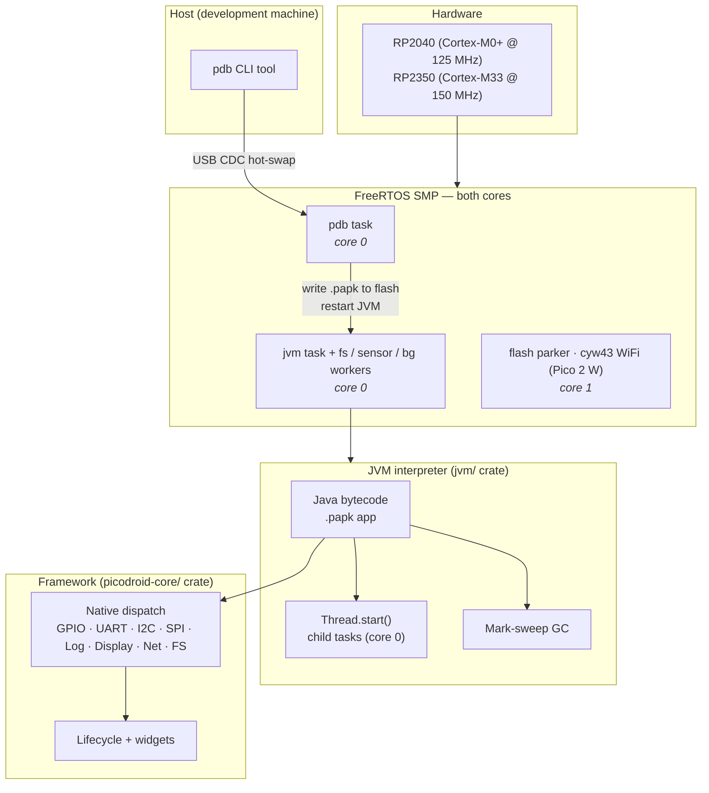

This document maps the picodroid-rs codebase by **reusability**: which pieces are written to be lifted into another project, which are picodroid-the-application, and where the boundaries between them sit.

For end-user docs (writing apps, porting to a new board, debugging) start at the [Overview](/).

## At a glance

Apps are hot-swapped at runtime with `pdb install`, without reflashing the
firmware. The rest of this page is the map behind that picture.

## Workspace crates

The workspace members are `platforms/rp`, `jvm`, `picodroid-core`, `compat`, `papk-format`, `pdb-protocol`, and the host tools under `tools/` (`papk-pack`, `papk-info`, `pdb`, `class-shrink`). The crates below are independently buildable (`cargo build -p <crate>` against a host target). `pico-jvm`, `compat`, and `class-shrink` have no picodroid-specific knowledge and could be picked up by a different project as-is; the rest are picodroid's shared layers, split out so device, simulator, and host tools consume one definition.

| Crate | Path | Purpose |
|---|---|---|
| `pico-jvm` | [`jvm/`](https://github.com/shivrajora/picodroid-rs/tree/main/jvm/) | `no_std` Java bytecode interpreter. Zero hardware deps. Native methods plug in via the [`NativeMethodHandler`](https://github.com/shivrajora/picodroid-rs/blob/main/jvm/src/native/mod.rs) trait. See [`jvm/README.md`](https://github.com/shivrajora/picodroid-rs/tree/main/jvm/README.md). |
| `picodroid-core` | [`picodroid-core/`](https://github.com/shivrajora/picodroid-rs/tree/main/picodroid-core/) | The family-neutral framework: JVM natives, widget set + LVGL engine, lifecycle, generic drivers, networking, install orchestration, and the shared host simulator. Consumed by every `platforms/<family>/` crate. |
| `compat` | [`compat/`](https://github.com/shivrajora/picodroid-rs/tree/main/compat/) | PAPK ↔ firmware version compatibility check. `no_std`. Shared by device + host. See [`compat/README.md`](https://github.com/shivrajora/picodroid-rs/tree/main/compat/README.md). |
| `papk-format` | [`papk-format/`](https://github.com/shivrajora/picodroid-rs/tree/main/papk-format/) | PAPK container + flash-image layout (boot-meta magic, scan, write). `no_std`. Shared by device + host tools. |
| `pdb-protocol` | [`pdb-protocol/`](https://github.com/shivrajora/picodroid-rs/tree/main/pdb-protocol/) | PDB wire protocol (framing, command/status codes) shared by the firmware and the `pdb` host tool. `no_std`. |
| `class-shrink` | [`tools/class-shrink/`](https://github.com/shivrajora/picodroid-rs/tree/main/tools/class-shrink/) | Build-time Java class/method name shrinker. Host-only (uses `std`). See [`tools/class-shrink/README.md`](https://github.com/shivrajora/picodroid-rs/tree/main/tools/class-shrink/README.md). |

## The picodroid binary

The [`picodroid`](https://github.com/shivrajora/picodroid-rs/tree/main/platforms/rp/src/) crate is an *application* of `pico-jvm` — it is not itself a library. It hosts the JVM on RP2040/RP2350 hardware (or a host simulator), binding `picodroid-core`'s framework — class loading, native dispatch, display and input — to this family's silicon, and exposes the developer-facing USB-CDC debugger (`pdb`).

Treat `platforms/rp/src/` as a **reference implementation** of how to embed `pico-jvm` on Cortex-M, not as code to lift wholesale into another project. For porting picodroid to a new board, see the [porting guide](/reference/porting-guide/).

## Module map

Since the family-neutral extraction the tree is two-layered: `platforms/rp/` holds only what knows it is on an RP2040/RP2350, and `picodroid-core/` holds everything shared by every family and the simulator.

### `platforms/rp/src/`

| Module | Purpose |
|---|---|
| [`app.rs`](https://github.com/shivrajora/picodroid-rs/blob/main/platforms/rp/src/app.rs) | This family's APK blob + post-run idle loop (JVM startup itself is `picodroid_core::boot`) |
| [`main.rs`](https://github.com/shivrajora/picodroid-rs/blob/main/platforms/rp/src/main.rs) | FreeRTOS init, hardware bringup |
| [`boards/`](https://github.com/shivrajora/picodroid-rs/tree/main/platforms/rp/src/boards/) | Per-board feature glue (memory layout, capability cfgs) |
| [`boot_budget.rs`](https://github.com/shivrajora/picodroid-rs/blob/main/platforms/rp/src/boot_budget.rs) | Boot memory budget (task stacks etc.) the sim pre-charges identically |
| [`boot_tasks.rs`](https://github.com/shivrajora/picodroid-rs/blob/main/platforms/rp/src/boot_tasks.rs) | Task topology (`flashpark`, `pdb`, `cyw43`, `jvm`) and the JVM supervisor loop |
| [`fs/`](https://github.com/shivrajora/picodroid-rs/tree/main/platforms/rp/src/fs/) | This family's end of the filesystem seam (LittleFS on-flash geometry) |
| [`gc_root_registration.rs`](https://github.com/shivrajora/picodroid-rs/blob/main/platforms/rp/src/gc_root_registration.rs) | Registers this crate's GC root providers with `picodroid_core::gc_roots` |
| [`glue.rs`](https://github.com/shivrajora/picodroid-rs/blob/main/platforms/rp/src/glue.rs) | The one file that binds core's seams to this family (`set_hal!`, `set_hal_fs!`, `set_hal_net!`, `set_rtos!`, `set_platform_hooks!`, `register_sim_platform!`) |
| [`hal/`](https://github.com/shivrajora/picodroid-rs/tree/main/platforms/rp/src/hal/) | Family HAL: [`contract.rs`](https://github.com/shivrajora/picodroid-rs/blob/main/platforms/rp/src/hal/contract.rs) shape assertions plus [`rp/`](https://github.com/shivrajora/picodroid-rs/tree/main/platforms/rp/src/hal/rp/) peripheral drivers — incl. [`port/`](https://github.com/shivrajora/picodroid-rs/tree/main/platforms/rp/src/hal/rp/port/) C shims, the [`pio_spi.rs`](https://github.com/shivrajora/picodroid-rs/blob/main/platforms/rp/src/hal/rp/pio_spi.rs) PIO+DMA gSPI transport, [`wifi_task.rs`](https://github.com/shivrajora/picodroid-rs/blob/main/platforms/rp/src/hal/rp/wifi_task.rs), and the [`core1_park.rs`](https://github.com/shivrajora/picodroid-rs/blob/main/platforms/rp/src/hal/rp/core1_park.rs) flash parker |
| [`packagemanager/`](https://github.com/shivrajora/picodroid-rs/tree/main/platforms/rp/src/packagemanager/) | This family's half of PAPK install over USB (orchestration is `picodroid_core::install`) |
| [`pdb/`](https://github.com/shivrajora/picodroid-rs/tree/main/platforms/rp/src/pdb/) | This family's debug bridge transport + task (protocol lives in `pdb-protocol`) |

### `picodroid-core/src/` (highlights)

| Module | Purpose |
|---|---|
| [`native_handler/`](https://github.com/shivrajora/picodroid-rs/tree/main/picodroid-core/src/native_handler/) | `pico-jvm` native dispatch (chain-of-responsibility per domain; `class_registry.rs`, `method_tables.rs`) |
| [`lifecycle.rs`](https://github.com/shivrajora/picodroid-rs/blob/main/picodroid-core/src/lifecycle.rs) | Application/Activity lifecycle, widget event dispatch |
| [`graphics/`](https://github.com/shivrajora/picodroid-rs/tree/main/picodroid-core/src/graphics/) | Widget set: backend-neutral surface + LVGL implementation |
| [`drivers/`](https://github.com/shivrajora/picodroid-rs/tree/main/picodroid-core/src/drivers/) | Chip-agnostic device drivers over `embedded-hal` (ST7789, XPT2046, BME688, LTR559, CYW43) |
| [`net/`](https://github.com/shivrajora/picodroid-rs/tree/main/picodroid-core/src/net/) | `picodroid.net` native implementations (sockets, HTTP, `NetworkInfo`) |
| [`os/`](https://github.com/shivrajora/picodroid-rs/tree/main/picodroid-core/src/os/) | `picodroid.os` natives (`SystemClock`) |
| [`pio/`](https://github.com/shivrajora/picodroid-rs/tree/main/picodroid-core/src/pio/) | Peripheral I/O natives (GPIO, I2C, SPI, UART, PWM, ADC) |
| [`executors/`](https://github.com/shivrajora/picodroid-rs/tree/main/picodroid-core/src/executors/) | Java executors: main-thread FIFO + background worker pool |
| [`monitor_store.rs`](https://github.com/shivrajora/picodroid-rs/blob/main/picodroid-core/src/monitor_store.rs) | Reentrant monitor store backing Java `synchronized` |
| [`lvgl_ffi.rs`](https://github.com/shivrajora/picodroid-rs/blob/main/picodroid-core/src/lvgl_ffi.rs) | Hand-written LVGL C bindings |
| [`install/`](https://github.com/shivrajora/picodroid-rs/tree/main/picodroid-core/src/install/) | PAPK install orchestration (transport-agnostic: validate, park, erase, stream, verify, commit) |
| [`fs/`](https://github.com/shivrajora/picodroid-rs/tree/main/picodroid-core/src/fs/) | LittleFS mounted once, reached through a serial worker |
| [`hal/sim/`](https://github.com/shivrajora/picodroid-rs/tree/main/picodroid-core/src/hal/sim/) | Shared simulator HAL — the host implementation of the hardware surface |
| [`sim_boot.rs`](https://github.com/shivrajora/picodroid-rs/blob/main/picodroid-core/src/sim_boot.rs) | Task topology for the simulator (`boot_tasks.rs` for the host) |
| [`mem_diag.rs`](https://github.com/shivrajora/picodroid-rs/blob/main/picodroid-core/src/mem_diag.rs) | Opt-in `mem-diag` memory monitor glue |

The old `[reusable] candidate` tags are gone: the second consumer materialised, and those modules now live in `picodroid-core`, where every family crate and the simulator consume them.

## Boundaries that should not be crossed

| Rule | Why |
|---|---|
| `pico-jvm` MUST NOT depend on `cortex_m`, `embassy`, `rp2*`, `cortex_m_rt`, or `panic_*` crates. | The JVM crate's value is that it is hardware-agnostic. Any of these imports would make it Cortex-M-only. Verify with `rg cortex_m jvm/src` (must be empty). |
| `pico-jvm` MUST NOT contain `picodroid/*` class names. | The JVM canonicalises class names via [`BUILTIN_CLASS_NAMES`](https://github.com/shivrajora/picodroid-rs/blob/main/jvm/src/native/mod.rs) plus the host-supplied list returned from [`NativeMethodHandler::native_class_names`](https://github.com/shivrajora/picodroid-rs/blob/main/jvm/src/native/mod.rs). Picodroid's list lives in [`PICODROID_NATIVE_CLASSES`](https://github.com/shivrajora/picodroid-rs/blob/main/picodroid-core/src/native_handler/class_registry.rs). |
| Adding a new entry to [`BUILTIN_DISPATCH`](https://github.com/shivrajora/picodroid-rs/blob/main/jvm/src/native/mod.rs) MUST also add it to `BUILTIN_CLASS_NAMES`. | Without canonicalisation, virtual dispatch silently returns "unknown" and breaks. The `builtin_dispatch_classes_subset_of_names` test enforces this. |
| Adding a new framework class with native methods MUST add its FQN to [`PICODROID_NATIVE_CLASSES`](https://github.com/shivrajora/picodroid-rs/blob/main/picodroid-core/src/native_handler/class_registry.rs). | Same canonicalisation hazard, on the host side. |
| `sdk/java/picodroid/` is the framework's Java-side surface — not a generic library. | Reusing it means you accept the picodroid widget/net/sensor vocabulary. If you want only the JVM, depend on `pico-jvm` directly. |
| `platforms/rp/src/hal/` MUST NOT import from `app`, `pdb`, or `packagemanager`. | HAL is a leaf. Verify with `rg "use crate::(app\|pdb\|packagemanager)" platforms/rp/src/hal/` (must be empty). |

## Multi-family seams

Picodroid runs on RP2040/RP2350 today. An ESP32-S3 (Lilygo T-Deck Plus) Milestone-1 port was scaffolded and then removed in 2026-07 — it lives in git history, and the `platforms/<family>/` layout it validated remains the pattern for future families. The codebase is structured so that adding a chip family is additive rather than touching dozens of files. The seams below are the contract for ports.

### Family routing

[platforms/rp/src/hal/mod.rs](https://github.com/shivrajora/picodroid-rs/blob/main/platforms/rp/src/hal/mod.rs) dispatches a single `mod chip;` to the active family via `cfg(feature = "family-<name>")`. Sim/test always routes to the shared simulator in [`picodroid-core/src/hal/sim/`](https://github.com/shivrajora/picodroid-rs/tree/main/picodroid-core/src/hal/sim/). Add a new family by creating a `platforms/<name>/` crate whose `glue.rs` implements **HAL CONTRACT v2** and forwards its `family-<name>` feature to `picodroid-core`.

### HAL CONTRACT v2

The contract is `picodroid_core::hal`'s traits — `HalDisplay`, `HalGpio`, `HalClock`, `HalTouch`, `HalI2c`, `HalAdc`, `HalPwm`, `HalSpi`, `HalUart`, `HalFs`, (under `cfg(has_network)`) `HalNet`, and `NetLink` (the network link driver a FreeRTOS+TCP family writes for its chip) — defined in [picodroid-core/src/hal/traits.rs](https://github.com/shivrajora/picodroid-rs/blob/main/picodroid-core/src/hal/traits.rs). A family implements them for one type and registers with `set_hal!` (see [platforms/rp/src/glue.rs](https://github.com/shivrajora/picodroid-rs/blob/main/platforms/rp/src/glue.rs)); a signature that drifts fails to compile at the impl. Every seam item a port implements — these traits, `Rtos`, `PlatformHooks`, the debug-bridge and installer traits, the filesystem trait, the registration macros — is re-exported from [picodroid-core/src/porting.rs](https://github.com/shivrajora/picodroid-rs/blob/main/picodroid-core/src/porting.rs), whose doc is the checklist and whose test keeps the [porting guide](/reference/porting-guide/) complete. `boot` and `flash` have no traits — they have no shared counterpart to form a contract with — and are still shape-asserted by [platforms/rp/src/hal/contract.rs](https://github.com/shivrajora/picodroid-rs/blob/main/platforms/rp/src/hal/contract.rs).

### MCU TOML schema

[platforms/&lt;family&gt;/mcus/&lt;family&gt;/&lt;mcu&gt;.toml](https://github.com/shivrajora/picodroid-rs/tree/main/platforms/rp/mcus/) drives the build. [build_support/freertos.rs](https://github.com/shivrajora/picodroid-rs/blob/main/build_support/freertos.rs) consumes:

- `freertos_port` — kernel port path
- `pico_shim` — extra C source compiled with the kernel
- `freertos_port_extra_includes` — semicolon-separated C include paths
- `freertos_c_defines` — semicolon-separated `KEY=VALUE` defines
- `freertos_vector_aliases` — semicolon-separated `CMSIS=portasm` linker aliases
- `init_array_segment` — destination memory region for `.init_array` (RP-specific quirk; leave unset on platforms that don't need it)

[build_support/network.rs](https://github.com/shivrajora/picodroid-rs/blob/main/build_support/network.rs) compiles FreeRTOS+TCP, the shared stack glue in `picodroid-core/net-freertos-tcp/`, and the link-driver sources a family lists in `NetStackBuild`; a `network_type` of `cyw43` also compiles the vendored cyw43 driver with the family's port file. Nothing in it names a chip family; the family's `build.rs` supplies its kernel port include and its port directory.

### Naming convention

- `family-<name>` (Cargo feature) — e.g. `family-rp`. Activated transitively by chip features.
- `chip-<mcu_name>` (Cargo feature) — e.g. `chip-rp2040`, `chip-rp2350`. Mechanical 1:1 with `platforms/<family>/mcus/<family>/<mcu_name>.toml`.
- `board-<board_name>` (Cargo feature) — e.g. `board-testbench-rp2040`. Mechanical 1:1 with `boards/<board_name>/`.

Boards declare their MCU via `mcu = "..."` in `board.toml`; [build_support/config.rs](https://github.com/shivrajora/picodroid-rs/blob/main/build_support/config.rs)::`resolve_active_mcu` reads it directly. Chip features only exist to gate dep crates.

### RP-specific patterns (boot, flash, timer)

The following are deeply RP-specific and live entirely under [`platforms/rp/`](https://github.com/shivrajora/picodroid-rs/tree/main/platforms/rp/). As hardware families are added, equivalent mechanisms (or replacements) are derived per family — the refactor's job was just to keep them isolated, not to abstract them.

- **SMP / cross-core FIFO / Amazon-SMP affinity APIs** — [boot_tasks.rs](https://github.com/shivrajora/picodroid-rs/blob/main/platforms/rp/src/boot_tasks.rs) creates every task through `task_affinity::spawn`, which takes a V11 SMP core-affinity mask spelled as `task_affinity::CORE0` / `CORE1` and suspends the scheduler around create+pin; a source-scan test in `task_affinity.rs` fails the build for any spawn that bypasses it. Other vendors' FreeRTOS forks differ (e.g. `xTaskCreatePinnedToCore`, stack sizes in bytes rather than words).
- **Install flow / flash parking** — PDB and JVM tasks are both pinned to core 0 (an RP2350 cross-core SRAM visibility bug retired the original cross-core park design); during install the JVM blocks on a FreeRTOS notification. Core 1 runs a dedicated `flashpark` parker task: each flash erase/program window first parks core 1 via a cross-core FreeRTOS task notification ([core1_park.rs](https://github.com/shivrajora/picodroid-rs/blob/main/platforms/rp/src/hal/rp/core1_park.rs)), then disables interrupts inside `with_xip_disabled!` ([flash.rs](https://github.com/shivrajora/picodroid-rs/blob/main/platforms/rp/src/hal/rp/flash.rs)). On testbench_rp2350w core 1 also hosts the `cyw43` WiFi task, at a priority below the parker.
- **`platforms/rp/mcus/rp/FreeRTOSConfig.h` ARM macros** — keyed off `__ARM_ARCH_8M_MAIN__`. A future family supplies its own config keyed to its architecture.
