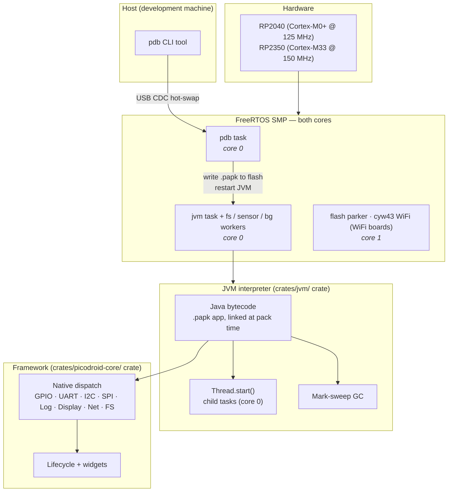

This document maps the picodroid-rs codebase by **reusability**: which pieces are written to be lifted into another project, which are picodroid-the-application, and where the boundaries between them sit.

For end-user docs (writing apps, porting to a new board, debugging) start at the [Overview](/).

## At a glance

```mermaid
graph TD
    subgraph Host["Host (development machine)"]
        PDB_CLI["pdb CLI tool"]
    end

    subgraph HW["Hardware"]
        SILICON["RP2040 (Cortex-M0+ @ 125 MHz)<br/>RP2350 (Cortex-M33 @ 150 MHz)"]
    end

    subgraph RTOS["FreeRTOS SMP — both cores"]
        PDB["pdb task<br/><i>core 0</i>"]
        JVM_TASK["jvm task + fs / sensor / bg workers<br/><i>core 0</i>"]
        CORE1["flash parker · cyw43 WiFi (WiFi boards)<br/><i>core 1</i>"]
    end

    subgraph JVM["JVM interpreter (crates/jvm/ crate)"]
        BC["Java bytecode<br/>.papk app, linked at pack time"]
        THREADS["Thread.start()<br/>child tasks (core 0)"]
        GC["Mark-sweep GC"]
    end

    subgraph CORE["Framework (crates/picodroid-core/ crate)"]
        NATIVE["Native dispatch<br/>GPIO · UART · I2C · SPI · Log · Display · Net · FS"]
        LIFECYCLE["Lifecycle + widgets"]
    end

    SILICON --> RTOS
    JVM_TASK --> JVM
    BC --> THREADS
    BC --> GC
    BC --> NATIVE
    NATIVE --> LIFECYCLE

    PDB_CLI -- "USB CDC hot-swap" --> PDB
    PDB -- "write .papk to flash<br/>restart JVM" --> JVM_TASK
```

Apps are hot-swapped at runtime with `pdb install`, without reflashing the
firmware. The rest of this page is the map behind that picture.

## How the runtime is put together

A few decisions shape everything else, and each has a design note under
[`docs/designs/`](https://github.com/shivrajora/picodroid-rs/tree/main/docs/designs/).

- **Classes are linked when they are packed.** `papk-pack` (apps) and the firmware build
  (the framework) run `crates/class-link` over every class: the record a class loader would
  parse, a name hash per class, superclass and interface, a signature hash per method, a 4-byte
  descriptor per method reference, and a class index sorted by hash. The runtime reads the
  tables in place from flash, so loading a class parses and allocates nothing (a registered
  class is 16 bytes of RAM), classes are found by binary search, and a resolved call never
  touches the constant pool. App and framework classes go through one reader
  (`class-link-2026-09.md`).
- **One task interprets Java at a time.** Every task that runs Java holds the JVM run lock, a
  kernel mutex in `crates/pd-rtos`, and gives it up only around a blocking wait, inside the
  RTOS seam's own wrappers. That is what keeps the shared heap safe without per-object locks
  (`jvm-run-lock-2026-09.md`). On the RP family every Java task is also pinned to core 0.
- **One heap, one loaded class set.** `Thread.start` children and background-pool workers
  share the main task's heap and its class set; each builds only its own interpreter state.
- **Stored values are 8 bytes.** Object fields, the collection buffers and lambda captures
  are held as an 8-byte `Slot` (a `long` or `double` takes two); call frames keep the 16-byte
  `Value` the opcode handlers pass around. `byte[]` and `boolean[]` are packed at one byte per
  element (`value-slot-8b.md`).
- **The hot code runs from SRAM on the RP2350.** The interpreter loop, the JVM's invoke and
  field helpers, and named LVGL and FreeRTOS functions are copied to RAM at boot, because the
  XIP cache cannot hold a UI's working set. The RAM comes out of the heap arena
  (`jvm_loop_ram_kb`, `hot_ram_kb`); the RP2040 has no room for it
  (`sram-hotpath-2026-09.md`).
- **Several apps share one flash region.** On a multi-app board the app region holds each
  installed PAPK as a run of 4 KB sectors behind a boot-meta sector; the package directory
  (`picodroid_core::packages`) is rebuilt from a scan of those runs at boot, and the launcher
  and settings apps are linked into the firmware. Each app's files live under `/data/<package>`
  on the one LittleFS volume, with a per-app cap and a reserve for the system
  (`multi-app-2026-09.md`).
- **Widget handles carry a generation.** A Java `nativeHandle` is a slot index plus that
  slot's generation, so the handle of a deleted widget reads as null instead of pointing into
  freed LVGL memory (`handle-table-invalidation.md`).
- **The main stack has a floor the linker enforces.** The core-0 main stack is what `.data`
  and `.bss` leave of RAM; the generated linker script asserts it is at least 8,192 bytes, so
  a static that grows too far fails the link instead of the boot.

## Workspace crates

The workspace members are `platforms/rp`, the crates under `crates/`, and the host tools under `tools/` (`papk-pack`, `papk-info`, `pdb`, `class-shrink`). The crates below are independently buildable (`cargo build -p <crate>` against a host target). Most of them have no picodroid-specific knowledge and could be picked up by a different project as-is; `picodroid-core` is the framework itself, and re-exports the smaller crates under the module paths they had before they were split out.

| Crate | Path | Purpose |
|---|---|---|
| `pico-jvm` | [`crates/jvm/`](https://github.com/shivrajora/picodroid-rs/tree/main/crates/jvm/) | `no_std` Java bytecode interpreter. Zero hardware deps. Native methods plug in via the [`NativeMethodHandler`](https://github.com/shivrajora/picodroid-rs/blob/main/crates/jvm/src/native/mod.rs) trait. See [`crates/jvm/README.md`](https://github.com/shivrajora/picodroid-rs/tree/main/crates/jvm/README.md). |
| `picodroid-core` | [`crates/picodroid-core/`](https://github.com/shivrajora/picodroid-rs/tree/main/crates/picodroid-core/) | The family-neutral framework: JVM natives, widget set + LVGL engine, lifecycle, generic drivers, networking, install orchestration, and the shared host simulator. Consumed by every `platforms/<family>/` crate. |
| `compat` | [`crates/compat/`](https://github.com/shivrajora/picodroid-rs/tree/main/crates/compat/) | PAPK ↔ firmware version compatibility check. `no_std`. Shared by device + host. See [`crates/compat/README.md`](https://github.com/shivrajora/picodroid-rs/tree/main/crates/compat/README.md). |
| `papk-format` | [`crates/papk-format/`](https://github.com/shivrajora/picodroid-rs/tree/main/crates/papk-format/) | PAPK container (format v2) + flash-image layout (boot-meta sector, scan, write): `no_std` zero-copy parser, `alloc`-gated writer. Shared by device + host tools. |
| `class-link` | [`crates/class-link/`](https://github.com/shivrajora/picodroid-rs/tree/main/crates/class-link/) | Pack-time link tables for class files and the class section that carries a set of classes with a sorted index. `no_std` reader, `alloc`-gated builder and validator. |
| `pdb-protocol` | [`crates/pdb-protocol/`](https://github.com/shivrajora/picodroid-rs/tree/main/crates/pdb-protocol/) | PDB wire protocol (framing, command/status codes) shared by the firmware and the `pdb` host tool. `no_std`. |
| `pd-rtos` | [`crates/pd-rtos/`](https://github.com/shivrajora/picodroid-rs/tree/main/crates/pd-rtos/) | The kernel seam: the `Rtos` trait (tasks, queues, mutexes, semaphores, tick timer, delays) bound at link time by `set_rtos!`, plus the JVM run lock. `no_std`, no FreeRTOS. |
| `pd-install` | [`crates/pd-install/`](https://github.com/shivrajora/picodroid-rs/tree/main/crates/pd-install/) | Streaming, CRC-checked installer for app images into a NOR flash region, generic over transport, flash, core parking and the package directory. `no_std`. |
| `pd-lvgl-sys` | [`crates/pd-lvgl-sys/`](https://github.com/shivrajora/picodroid-rs/tree/main/crates/pd-lvgl-sys/) | Hand-written `no_std` LVGL v9.6 bindings plus the build of the vendored C sources, configured per board. |
| `pd-drivers` | [`crates/pd-drivers/`](https://github.com/shivrajora/picodroid-rs/tree/main/crates/pd-drivers/) | `embedded-hal` drivers: ST7789 / ST7796 panels, XPT2046 and GT911 touch, BME688 and LTR559 sensors. |
| `pd-json` | [`crates/pd-json/`](https://github.com/shivrajora/picodroid-rs/tree/main/crates/pd-json/) | Bounded `no_std` + `alloc` JSON tree: parser, capped node pool, serializer. Behind `picodroid.json`. |
| `pd-tls` | [`crates/pd-tls/`](https://github.com/shivrajora/picodroid-rs/tree/main/crates/pd-tls/) | TLS 1.3 client pieces: the compiled-in trust store, the certificate verifier, a session over any `embedded-io` socket, the handshake RNG. Behind `has_tls`. |
| `http-head` | [`crates/http-head/`](https://github.com/shivrajora/picodroid-rs/tree/main/crates/http-head/) | `no_std` HTTP/1.1 head parsing and a streaming chunked-transfer decoder. |
| `heap4` | [`crates/heap4/`](https://github.com/shivrajora/picodroid-rs/tree/main/crates/heap4/) | Rust port of FreeRTOS `heap_4` that keeps 32-bit block arithmetic on a 64-bit host, so the simulator reproduces a device heap. |
| `picodroid-build-support` | [`crates/build_support/`](https://github.com/shivrajora/picodroid-rs/tree/main/crates/build_support/) | Build-script library: `board.toml` parsing, board-derived codegen, flash layout, the C builds, PAPK and framework embedding. Host-only. |
| `class-shrink` | [`tools/class-shrink/`](https://github.com/shivrajora/picodroid-rs/tree/main/tools/class-shrink/) | Build-time Java class/method name shrinker. Host-only (uses `std`). See [`tools/class-shrink/README.md`](https://github.com/shivrajora/picodroid-rs/tree/main/tools/class-shrink/README.md). |

## The picodroid binary

The [`picodroid`](https://github.com/shivrajora/picodroid-rs/tree/main/platforms/rp/src/) crate is an *application* of `pico-jvm` — it is not itself a library. It hosts the JVM on RP2040/RP2350 hardware (or a host simulator), binding `picodroid-core`'s framework — class loading, native dispatch, display and input — to this family's silicon, and exposes the developer-facing USB-CDC debugger (`pdb`).

Treat `platforms/rp/src/` as a **reference implementation** of how to embed `pico-jvm` on Cortex-M, not as code to lift wholesale into another project. For porting picodroid to a new board, see the [porting guide](/reference/porting-guide/).

## Module map

Since the family-neutral extraction the tree is two-layered: `platforms/rp/` holds only what knows it is on an RP2040/RP2350, and `crates/picodroid-core/` holds everything shared by every family and the simulator.

### `platforms/rp/src/`

| Module | Purpose |
|---|---|
| [`app.rs`](https://github.com/shivrajora/picodroid-rs/blob/main/platforms/rp/src/app.rs) | This family's APK blob + post-run idle loop (JVM startup itself is `picodroid_core::boot`) |
| [`main.rs`](https://github.com/shivrajora/picodroid-rs/blob/main/platforms/rp/src/main.rs) | FreeRTOS init, hardware bringup |
| [`boards/`](https://github.com/shivrajora/picodroid-rs/tree/main/platforms/rp/src/boards/) | Per-board feature glue (memory layout, capability cfgs) |
| [`boot_budget.rs`](https://github.com/shivrajora/picodroid-rs/blob/main/platforms/rp/src/boot_budget.rs) | Boot memory budget (task stacks etc.) the sim pre-charges identically |
| [`boot_tasks.rs`](https://github.com/shivrajora/picodroid-rs/blob/main/platforms/rp/src/boot_tasks.rs) | Task topology (`flashpark`, `pdb`, `cyw43`, `jvm`) and the JVM supervisor loop |
| [`task_affinity.rs`](https://github.com/shivrajora/picodroid-rs/blob/main/platforms/rp/src/task_affinity.rs) | Dual-core placement: the one spawn helper and the source scan that enforces it |
| [`spin_guard.rs`](https://github.com/shivrajora/picodroid-rs/blob/main/platforms/rp/src/spin_guard.rs) | The source scan that rejects a bare register-poll loop (`spin_until!` or a `spin-ok:` comment) |
| [`fs/`](https://github.com/shivrajora/picodroid-rs/tree/main/platforms/rp/src/fs/) | This family's end of the filesystem seam (LittleFS on-flash geometry) |
| [`gc_root_registration.rs`](https://github.com/shivrajora/picodroid-rs/blob/main/platforms/rp/src/gc_root_registration.rs) | Registers this crate's GC root providers with `picodroid_core::gc_roots` |
| [`glue.rs`](https://github.com/shivrajora/picodroid-rs/blob/main/platforms/rp/src/glue.rs) | The one file that binds core's seams to this family (`set_hal!`, `set_hal_fs!`, `set_hal_net!`, `set_rtos!`, `set_platform_hooks!`, `register_sim_platform!`) |
| [`hal/`](https://github.com/shivrajora/picodroid-rs/tree/main/platforms/rp/src/hal/) | Family HAL: [`contract.rs`](https://github.com/shivrajora/picodroid-rs/blob/main/platforms/rp/src/hal/contract.rs) shape assertions plus [`rp/`](https://github.com/shivrajora/picodroid-rs/tree/main/platforms/rp/src/hal/rp/) peripheral drivers — incl. [`port/`](https://github.com/shivrajora/picodroid-rs/tree/main/platforms/rp/src/hal/rp/port/) C shims, the [`pio_spi.rs`](https://github.com/shivrajora/picodroid-rs/blob/main/platforms/rp/src/hal/rp/pio_spi.rs) PIO+DMA gSPI transport, the [`cyw43/`](https://github.com/shivrajora/picodroid-rs/tree/main/platforms/rp/src/hal/rp/cyw43/) WiFi link, [`psram.rs`](https://github.com/shivrajora/picodroid-rs/blob/main/platforms/rp/src/hal/rp/psram.rs) (the RP2350B module's PSRAM), [`xip.rs`](https://github.com/shivrajora/picodroid-rs/blob/main/platforms/rp/src/hal/rp/xip.rs), and the [`core1_park.rs`](https://github.com/shivrajora/picodroid-rs/blob/main/platforms/rp/src/hal/rp/core1_park.rs) flash parker |
| [`packagemanager/`](https://github.com/shivrajora/picodroid-rs/tree/main/platforms/rp/src/packagemanager/) | This family's half of PAPK install over USB: `PapkRegionFlash` over the flash primitives (orchestration is `picodroid_core::install`, the `pd-install` crate) |
| [`pdb/`](https://github.com/shivrajora/picodroid-rs/tree/main/platforms/rp/src/pdb/) | This family's debug bridge transport + task (protocol lives in `pdb-protocol`) |

### `crates/picodroid-core/src/` (highlights)

| Module | Purpose |
|---|---|
| [`boot.rs`](https://github.com/shivrajora/picodroid-rs/blob/main/crates/picodroid-core/src/boot.rs) | The shared JVM heap, class registration (the framework's class section, then the app's) and `run_app` |
| [`framework_classes.rs`](https://github.com/shivrajora/picodroid-rs/blob/main/crates/picodroid-core/src/framework_classes.rs) | The SDK's classes as one class section embedded in the firmware, linked at build time |
| [`packages.rs`](https://github.com/shivrajora/picodroid-rs/blob/main/crates/picodroid-core/src/packages.rs) | The package directory: the scan of the app region, the system apps, which image boots and which runs next |
| [`storage/`](https://github.com/shivrajora/picodroid-rs/tree/main/crates/picodroid-core/src/storage/) | Per-app storage: the `/data/<package>` sandbox and the quota |
| [`porting.rs`](https://github.com/shivrajora/picodroid-rs/blob/main/crates/picodroid-core/src/porting.rs) | What a port provides: every seam item re-exported, with the checklist as its doc |
| [`rtos/`](https://github.com/shivrajora/picodroid-rs/tree/main/crates/picodroid-core/src/rtos/) | Re-export of the `pd-rtos` crate; `rtos/freertos.rs` is the one FreeRTOS-naming module outside the simulator |
| [`native_handler/`](https://github.com/shivrajora/picodroid-rs/tree/main/crates/picodroid-core/src/native_handler/) | `pico-jvm` native dispatch (chain-of-responsibility per domain; `class_registry.rs`, `method_tables.rs`) |
| [`lifecycle/`](https://github.com/shivrajora/picodroid-rs/tree/main/crates/picodroid-core/src/lifecycle/) | Application/Activity lifecycle: the run loops (`mod.rs`), the back stack (`activity_stack.rs`), widget event dispatch (`widget_events.rs`), touch/key input (`input.rs`), alarm delivery (`alarm_events.rs`) |
| [`graphics/`](https://github.com/shivrajora/picodroid-rs/tree/main/crates/picodroid-core/src/graphics/) | Widget set: backend-neutral surface + LVGL implementation |
| [`drivers`](https://github.com/shivrajora/picodroid-rs/tree/main/crates/pd-drivers/src/) | Re-export of the `pd-drivers` crate: chip-agnostic device drivers over `embedded-hal` (ST7789, ST7796, XPT2046, GT911, BME688, LTR559) |
| [`net/`](https://github.com/shivrajora/picodroid-rs/tree/main/crates/picodroid-core/src/net/) | `picodroid.net` native implementations (sockets, HTTP, `NetworkInfo`) |
| [`os/`](https://github.com/shivrajora/picodroid-rs/tree/main/crates/picodroid-core/src/os/) | `picodroid.os` natives (`SystemClock`) |
| [`pio/`](https://github.com/shivrajora/picodroid-rs/tree/main/crates/picodroid-core/src/pio/) | Peripheral I/O natives (GPIO, I2C, SPI, UART, PWM, ADC) |
| [`executors/`](https://github.com/shivrajora/picodroid-rs/tree/main/crates/picodroid-core/src/executors/) | Java executors: main-thread FIFO + background worker pool |
| [`monitor_store.rs`](https://github.com/shivrajora/picodroid-rs/blob/main/crates/picodroid-core/src/monitor_store.rs) | Reentrant monitor store backing Java `synchronized` |
| [`lvgl_ffi`](https://github.com/shivrajora/picodroid-rs/blob/main/crates/pd-lvgl-sys/src/lib.rs) | Re-export of the `pd-lvgl-sys` crate: hand-written LVGL C bindings plus the LVGL C build |
| [`install/`](https://github.com/shivrajora/picodroid-rs/tree/main/crates/picodroid-core/src/install/) | The `pd-install` crate (validate, place, park, erase, stream, verify, commit), bound to this firmware's package directory and framework-map version |
| [`fs/`](https://github.com/shivrajora/picodroid-rs/tree/main/crates/picodroid-core/src/fs/) | LittleFS mounted once, reached through a serial worker |
| [`hal/sim/`](https://github.com/shivrajora/picodroid-rs/tree/main/crates/picodroid-core/src/hal/sim/) | Shared simulator HAL — the host implementation of the hardware surface |
| [`sim_boot.rs`](https://github.com/shivrajora/picodroid-rs/blob/main/crates/picodroid-core/src/sim_boot.rs) | Task topology for the simulator (`boot_tasks.rs` for the host) |
| [`mem_diag.rs`](https://github.com/shivrajora/picodroid-rs/blob/main/crates/picodroid-core/src/mem_diag.rs) | Opt-in `mem-diag` memory monitor glue |
| [`sched_diag.rs`](https://github.com/shivrajora/picodroid-rs/blob/main/crates/picodroid-core/src/sched_diag.rs) | Opt-in `sched-diag` scheduling monitor |

The old `[reusable] candidate` tags are gone: the second consumer materialised, and those modules now live in `picodroid-core`, where every family crate and the simulator consume them. The 2026-09 code-health round went one step further for the ones that were cheap to extract (`pd-rtos`, `pd-install`, `pd-lvgl-sys`, `pd-drivers`, `pd-json`, `http-head`, `heap4`): each is a crate of its own, re-exported from `picodroid-core` under its old module path.

## Boundaries that should not be crossed

| Rule | Why |
|---|---|
| `pico-jvm` MUST NOT depend on `cortex_m`, `embassy`, `rp2*`, `cortex_m_rt`, or `panic_*` crates. | The JVM crate's value is that it is hardware-agnostic. Any of these imports would make it Cortex-M-only. Verify with `rg cortex_m crates/jvm/src` (must be empty). |
| `pico-jvm` MUST NOT contain `picodroid/*` class names. | The JVM canonicalises class names via [`BUILTIN_CLASS_NAMES`](https://github.com/shivrajora/picodroid-rs/blob/main/crates/jvm/src/native/mod.rs) plus the host-supplied list returned from [`NativeMethodHandler::native_class_names`](https://github.com/shivrajora/picodroid-rs/blob/main/crates/jvm/src/native/mod.rs). Picodroid's list lives in [`PICODROID_NATIVE_CLASSES`](https://github.com/shivrajora/picodroid-rs/blob/main/crates/picodroid-core/src/native_handler/class_registry.rs). |
| Adding a new entry to [`BUILTIN_DISPATCH`](https://github.com/shivrajora/picodroid-rs/blob/main/crates/jvm/src/native/mod.rs) MUST also add it to `BUILTIN_CLASS_NAMES`. | Without canonicalisation, virtual dispatch silently returns "unknown" and breaks. The `builtin_dispatch_classes_subset_of_names` test enforces this. |
| Adding a new framework class with native methods MUST add its FQN to [`PICODROID_NATIVE_CLASSES`](https://github.com/shivrajora/picodroid-rs/blob/main/crates/picodroid-core/src/native_handler/class_registry.rs). | Same canonicalisation hazard, on the host side. |
| `sdk/java/picodroid/` is the framework's Java-side surface — not a generic library. | Reusing it means you accept the picodroid widget/net/sensor vocabulary. If you want only the JVM, depend on `pico-jvm` directly. |
| `platforms/rp/src/hal/` MUST NOT import from `app`, `pdb`, or `packagemanager`. | HAL is a leaf. Verify with `rg "use crate::(app\|pdb\|packagemanager)" platforms/rp/src/hal/` (must be empty). |
| A platform crate MUST NOT construct a `Jvm` — hand off to [`boot::run_app`](https://github.com/shivrajora/picodroid-rs/blob/main/crates/picodroid-core/src/boot.rs). | Two JVM-driving crates monomorphise the interpreter twice: measured at ~38 KB, which overflowed the RP2040 flash ceiling. LTO does not rescue it. |
| A file MUST NOT exist at the same relative path under both `platforms/*/src` and `crates/picodroid-core/src`. | Shadow twins compile, one copy goes dead, and they drift silently. Enforced by `scripts/pre-commit`, with an allowlist for the four genuine seam pairs (`gc_root_registration.rs`, `hal/mod.rs`, `pdb/mod.rs`, `fs/mod.rs`). |
| Every task the RP family creates MUST go through `task_affinity::spawn`, naming its core. | The shared JVM heap relies on one core interpreting Java; `volatile` is ignored and no barriers are emitted. `spawn` makes create+pin one scheduler-atomic step. Enforced by the source scan in [task_affinity.rs](https://github.com/shivrajora/picodroid-rs/blob/main/platforms/rp/src/task_affinity.rs), which runs under `scripts/test.sh`. |
| A blocking wait reachable from Java that does not go through the `rtos` seam wrappers MUST release the JVM run lock around it; a short wait inside a native that is mid-mutation MUST NOT. | Only the task holding the [run lock](https://github.com/shivrajora/picodroid-rs/blob/main/crates/pd-rtos/src/run_lock.rs) interprets Java. A wait that keeps the lock freezes every other Java thread for its length; one that releases while a native holds unrooted state hands a sibling the heap at the wrong moment. The seam wrappers and the network facade already release. |
| A native module holding Java object references MUST register a GC root provider. | An unregistered provider is swept while live and fails much later as dead input or `NoSuchMethod`. Both crates carry a source-scanning guard over `gc_root_registration.rs`. |
| Shared code reaches the kernel only through `picodroid_core::rtos`. | Otherwise a second family cannot register its own kernel. Enforced by `rtos::seam_guard`, a source scan that bans FreeRTOS API names outside the simulator's backing and `rtos/freertos.rs`. |
| Wire formats live in the small protocol crates (`pdb-protocol`, `papk-format`, `class-link`) and are never hand-mirrored. | A copy on each end drifts, and here a drift fails as a corrupt install or an undetected device rather than loudly. |

## Multi-family seams

Picodroid runs on RP2040/RP2350 today. An ESP32-S3 (Lilygo T-Deck Plus) Milestone-1 port was scaffolded and then removed in 2026-07 — it lives in git history, and the `platforms/<family>/` layout it validated remains the pattern for future families. The codebase is structured so that adding a chip family is additive rather than touching dozens of files. The seams below are the contract for ports.

### Family routing

A family is its own binary crate under `platforms/<name>/`, depending on `picodroid-core`; nothing in `picodroid-core` needs editing to add one. [platforms/rp/src/hal/mod.rs](https://github.com/shivrajora/picodroid-rs/blob/main/platforms/rp/src/hal/mod.rs) dispatches a single `mod chip;` to the active family via `cfg(feature = "family-<name>")`. Sim/test always routes to the shared simulator in [`crates/picodroid-core/src/hal/sim/`](https://github.com/shivrajora/picodroid-rs/tree/main/crates/picodroid-core/src/hal/sim/). Add a new family by creating a `platforms/<name>/` crate whose `glue.rs` implements **HAL CONTRACT v2** and forwards its `family-<name>` feature to `picodroid-core`.

### HAL CONTRACT v2

The contract is `picodroid_core::hal`'s traits — `HalDisplay`, `HalGpio`, `HalClock`, `HalTouch`, `HalI2c`, `HalAdc`, `HalPwm`, `HalSpi`, `HalUart`, `HalFs`, (under `cfg(has_network)`) `HalNet`, and `NetLink` (the network link driver a FreeRTOS+TCP family writes for its chip) — defined in [crates/picodroid-core/src/hal/traits.rs](https://github.com/shivrajora/picodroid-rs/blob/main/crates/picodroid-core/src/hal/traits.rs). A family implements them for one type and registers with `set_hal!` (see [platforms/rp/src/glue.rs](https://github.com/shivrajora/picodroid-rs/blob/main/platforms/rp/src/glue.rs)); a signature that drifts fails to compile at the impl. Every seam item a port implements — these traits, `Rtos`, `PlatformHooks`, the debug-bridge and installer traits, the filesystem trait, the registration macros — is re-exported from [crates/picodroid-core/src/porting.rs](https://github.com/shivrajora/picodroid-rs/blob/main/crates/picodroid-core/src/porting.rs), whose doc is the checklist and whose test keeps the [porting guide](/reference/porting-guide/) complete. `boot` and `flash` have no traits — they have no shared counterpart to form a contract with — and are still shape-asserted by [platforms/rp/src/hal/contract.rs](https://github.com/shivrajora/picodroid-rs/blob/main/platforms/rp/src/hal/contract.rs).

### MCU TOML schema

[platforms/&lt;family&gt;/mcus/&lt;family&gt;/&lt;mcu&gt;.toml](https://github.com/shivrajora/picodroid-rs/tree/main/platforms/rp/mcus/) drives the build. [crates/build_support/freertos.rs](https://github.com/shivrajora/picodroid-rs/blob/main/crates/build_support/freertos.rs) consumes:

- `freertos_port` — kernel port path
- `pico_shim` — extra C source compiled with the kernel
- `freertos_port_extra_includes` — semicolon-separated C include paths
- `freertos_c_defines` — semicolon-separated `KEY=VALUE` defines
- `freertos_vector_aliases` — semicolon-separated `CMSIS=portasm` linker aliases
- `init_array_segment` — destination memory region for `.init_array` (RP-specific quirk; leave unset on platforms that don't need it)
- `heap_kb` — the FreeRTOS heap arena, less `jvm_loop_ram_kb` and the board's `hot_ram_kb` where code runs from RAM

`c_opt_level` (read by `config.rs`) pins the optimisation level of every C object built for the MCU; all three RP descriptors set `"s"`.

[crates/build_support/flash_layout.rs](https://github.com/shivrajora/picodroid-rs/blob/main/crates/build_support/flash_layout.rs) lays flash out from `flash_kb`, `fs_kb`, `app_region_kb` and `max_installed_apps` (a board may override the last three), renders the linker script's `MEMORY` block, and asserts the main-stack floor. The per-board results are in [System limits](/reference/limits/).

[crates/build_support/network.rs](https://github.com/shivrajora/picodroid-rs/blob/main/crates/build_support/network.rs) compiles FreeRTOS+TCP, the shared stack glue in `crates/picodroid-core/net-freertos-tcp/`, and the link-driver sources a family lists in `NetStackBuild`; a `network_type` of `cyw43` also compiles the vendored cyw43 driver with the family's port file. Nothing in it names a chip family; the family's `build.rs` supplies its kernel port include and its port directory.

### Naming convention

- `family-<name>` (Cargo feature) — e.g. `family-rp`. Activated transitively by chip features.
- `chip-<mcu_name>` (Cargo feature) — e.g. `chip-rp2040`, `chip-rp2350`. One per HAL crate rather than per descriptor: the `rp2350` and `rp2350b` descriptors under `platforms/<family>/mcus/<family>/` both build with `chip-rp2350`.
- `board-<board_name>` (Cargo feature) — e.g. `board-testbench-rp2040`. Mechanical 1:1 with `boards/<board_name>/`.

Boards declare their MCU via `mcu = "..."` in `board.toml`; [crates/build_support/config.rs](https://github.com/shivrajora/picodroid-rs/blob/main/crates/build_support/config.rs)::`resolve_active_mcu` reads it directly. Chip features only exist to gate dep crates.

### RP-specific patterns (boot, flash, timer)

The following are deeply RP-specific and live entirely under [`platforms/rp/`](https://github.com/shivrajora/picodroid-rs/tree/main/platforms/rp/). As hardware families are added, equivalent mechanisms (or replacements) are derived per family — the refactor's job was just to keep them isolated, not to abstract them.

- **SMP / cross-core FIFO / Amazon-SMP affinity APIs** — [boot_tasks.rs](https://github.com/shivrajora/picodroid-rs/blob/main/platforms/rp/src/boot_tasks.rs) creates every task through `task_affinity::spawn`, which takes a V11 SMP core-affinity mask spelled as `task_affinity::CORE0` / `CORE1` and suspends the scheduler around create+pin; a source-scan test in `task_affinity.rs` fails the build for any spawn that bypasses it. Other vendors' FreeRTOS forks differ (e.g. `xTaskCreatePinnedToCore`, stack sizes in bytes rather than words).
- **Install flow / flash parking** — PDB and JVM tasks are both pinned to core 0 (an RP2350 cross-core SRAM visibility bug retired the original cross-core park design); during install the JVM blocks on a FreeRTOS notification. Core 1 runs a dedicated `flashpark` parker task: each flash erase/program window first parks core 1 via a cross-core FreeRTOS task notification ([core1_park.rs](https://github.com/shivrajora/picodroid-rs/blob/main/platforms/rp/src/hal/rp/core1_park.rs)), then disables interrupts inside `with_xip_disabled!` ([flash.rs](https://github.com/shivrajora/picodroid-rs/blob/main/platforms/rp/src/hal/rp/flash.rs)). On the WiFi boards core 1 also hosts the `cyw43` WiFi task, at a priority below the parker.
- **`platforms/rp/mcus/rp/FreeRTOSConfig.h` ARM macros** — keyed off `__ARM_ARCH_8M_MAIN__`. A future family supplies its own config keyed to its architecture.
